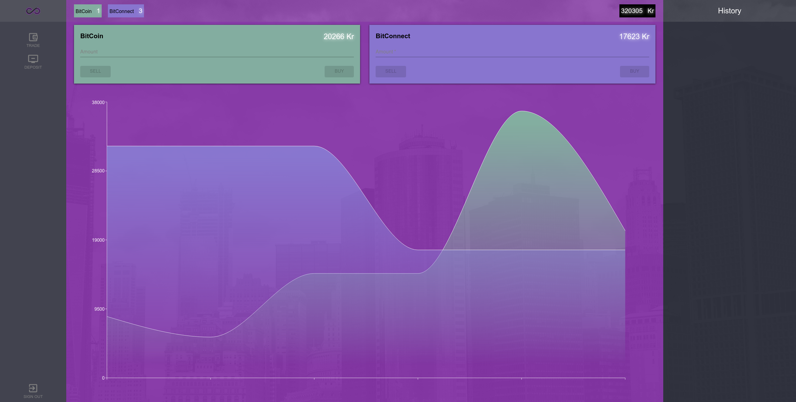

# Crypto Trading Platform - Platform
[](https://scrutinizer-ci.com/g/8ptk4/crypto-trading/?branch=master)

## Table of contents
* [General info](#general-info)
* [Technologies](#technologies)
* [Setup](#setup)

## General info
Crypto Trading Platform, where user can register, login, add currency, buy crypto with realtime visualization of prices and charts.


	
## Technologies
"@material-ui/core": "^4.5.0",
"@material-ui/icons": "^4.4.3",
"axios": "^0.21.1",
"bootstrap": "^4.3.1",
"final-form": "^4.18.5",
"final-form-material-ui": "^0.3.0",
"jwt-decode": "^3.1.2",
"react": "^16.10.2",
"react-bootstrap": "^1.0.0-beta.14",
"react-burger-menu": "^2.6.11",
"react-custom-scrollbars": "^4.2.1",
"react-dom": "^16.10.2",
"react-final-form": "^6.3.0",
"react-number-format": "^5.0.0-beta.4",
"react-router-dom": "^5.1.2",
"react-scripts": "^3.4.4",
"recharts": "^1.8.3",
"socket.io-client": "^4.5.3"
## Setup
- run ```npm i && npm start```

- create .env file in root, add ```REACT_APP_BACKEND={backend}```